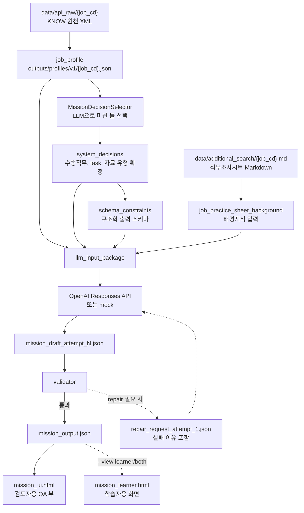

# Job Mission Prototype 3

KNOW/고용24 직업 데이터를 바탕으로 직무형 학습 미션을 생성하고, 생성 결과를 검증한 뒤 검토자용/학습자용 HTML로 내보내는 Python 프로토타입입니다.

현재 파이프라인의 기본 방향은 다음과 같습니다.

- 직무 원천 XML에서 `job_profile`을 만든다.
- LLM 기반 `MissionDecisionSelector`로 수행직무, task 유형, 자료 유형의 틀을 먼저 고른다.
- `data/additional_search/{job_cd}.md` 직무조사시트를 배경지식으로 넣어 미션을 생성한다.
- validator가 구조, 자료 참조, evidence 연결, rubric, glossary 등을 검사한다.
- 통과한 결과만 `mission_output.json`으로 저장하고 HTML로 내보낸다.

## Current Pipeline

아래 다이어그램은 현재 우리가 기본으로 사용할 생성 경로만 단순화해 표시합니다.



## How To Read The Pipeline

위 다이어그램은 “미션 하나가 만들어지는 길”을 압축해서 보여줍니다.

1. `job_profile`은 KNOW 원천 XML을 코드가 읽어서 만든 직무 요약 JSON입니다. 수행직무, 필요 지식/능력/활동 evidence, 원천 XML 위치가 정리됩니다.
2. `MissionDecisionSelector`는 최종 미션을 쓰는 LLM이 아닙니다. 미션 생성 전에 “어떤 수행직무를 대상으로 할지”, “어떤 task 유형과 자료 유형을 쓸지”를 먼저 고르는 전처리 LLM 호출입니다.
3. `system_decisions`는 selector 결과를 검증한 뒤 확정한 미션 설계 방향입니다. 이후 미션 생성 LLM은 이 결정을 따라야 합니다.
4. `job_practice_sheet_background`는 사람이 작성한 `data/additional_search/{job_cd}.md` 직무조사시트 원문을 JSON 필드로 감싼 배경지식입니다.
5. `llm_input_package`는 최종 미션 생성 LLM에 전달할 입력 묶음입니다. 현재 기본 경로에서는 `job_profile`, `system_decisions`, `schema_constraints`, `job_practice_sheet_background`가 들어갑니다.
6. `validator`는 LLM 초안이 규칙을 지켰는지 검사합니다. 통과하면 `mission_output.json`이 되고, 고칠 수 있는 문제면 repair 요청을 한 번 더 보냅니다. validator가 어떤 부분을 점검하는지에 대한 대략적인 정리는 `document/mission_generation_flow.md`의 `Validation and Repair` 섹션에 있습니다.

즉, `MissionDecisionSelector`는 “미션의 틀”을 고르고, `MissionDraftGenerator`는 그 틀과 배경지식을 바탕으로 “실제 미션 내용”을 씁니다.

## Current Defaults

현재 코드 기준 기본값은 다음과 같습니다.

| 항목 | 기본 동작 |
|---|---|
| 미션 틀 선택 | `MissionDecisionSelector` 사용 |
| 실무 배경 입력 | `data/additional_search/{job_cd}.md`를 `job_practice_sheet_background`로 사용 |
| legacy seed | 기본 미사용. `--mission-seed` 옵션을 줄 때만 `mission_seed` 경로 사용 |
| HTML export | 기본은 `mission_ui.html`만 생성. `--view learner` 또는 `--view both`로 학습자용 생성 |
| glossary | `mission.scenario.glossary` 필수, 빈 배열 허용 |
| validator | 구조/참조/evidence/rubric/glossary를 검증. 단순 외부지식 키워드 차단은 제거됨 |

`MissionDecisionSelector`가 실제 LLM 응답을 받았지만 `DecisionSelectorValidator` 검증에 실패하면 해당 target은 `decision_failed`로 종료됩니다. 이때 `auto_pilot_config`나 legacy rule로 자동 fallback하지 않습니다. 단, `--mock` 또는 API key 없음처럼 selector 호출 자체가 로컬에서 skipped 된 개발 상황에서는 테스트 실행을 위해 legacy `SystemDecisionBuilder`를 사용합니다.

## What Goes Into The Mission LLM

미션 본문을 생성하는 LLM에는 저장된 `llm_input_package.json`을 바탕으로 만든 prompt가 들어갑니다. 이전 complete run 기준으로 21개 미션 모두 다음 네 가지가 들어갔습니다.

| 입력 | 의미 |
|---|---|
| `job_profile` | KNOW XML에서 만든 직무 구조화 정보 |
| `system_decisions` | selector가 고르고 validator가 통과시킨 수행직무/task/material 방향 |
| `schema_constraints` | 미션 JSON이 지켜야 하는 구조와 규칙 |
| `job_practice_sheet_background` | 직무조사시트 Markdown 원문을 배경지식으로 넣은 JSON |

`schema_constraints` 안의 `structured_output_schema`는 저장 파일에는 남아 있지만, prompt 본문에서는 제거됩니다. 대신 OpenAI Responses API의 structured output schema 설정으로 별도 전달됩니다. 이렇게 해서 prompt 길이는 줄이고, JSON 구조 강제는 유지합니다.

`mission_seed`는 현재 기본 경로에서는 들어가지 않습니다. 필요할 때만 `--mission-seed` 옵션으로 legacy 흐름을 사용합니다.

## Practice Sheet Background

`job_practice_sheet_background`는 사람이 따로 새 JSON을 작성하는 파일이 아닙니다. 원본은 직무별 Markdown 조사시트입니다.

```text
data/additional_search/{job_cd}.md
```

예를 들어 `K000001080` 직무라면 원본은 다음 파일입니다.

```text
data/additional_search/K000001080.md
```

실행 중 `PracticeSheetBackgroundLoader`가 이 Markdown 파일을 읽고, 아래처럼 JSON 형태로 감싸서 저장합니다.

```json
{
  "schema_version": "job_practice_sheet_background.v1",
  "job_cd": "K000001080",
  "source_path": "data/additional_search/K000001080.md",
  "content_markdown": "...Markdown 원문 전체...",
  "usage": "background_only"
}
```

핵심은 `content_markdown`입니다. Markdown 본문이 그대로 이 필드에 들어갑니다. `usage: background_only`는 이 내용을 정답 근거로 노출하라는 뜻이 아니라, 미션을 더 현실감 있게 만들기 위한 배경지식으로만 쓰라는 뜻입니다.

## Reference Run

최신으로 커밋해 둔 기준 산출물은 다음 run입니다.

```text
pilot_v1_20260527_032732_complete
```

이 run은 7개 직무 x 3개 난이도 = 21개 미션을 포함합니다.

| job_cd | 직업명 |
|---|---|
| `K000000872` | 광고·홍보·마케팅전문가 |
| `K000000997` | 상품기획자 |
| `K000001080` | 데이터분석가(빅데이터분석가) |
| `K000001179` | 투자분석가 |
| `K000001196` | 인사·교육·훈련사무원 |
| `K000001222` | 방송기자 |
| `K000007519` | 보험상품개발자 |

주요 위치:

```text
outputs/pilot/v1/runs/pilot_v1_20260527_032732_complete/
outputs/ui/v1/runs/pilot_v1_20260527_032732_complete/mission_ui.html
outputs/ui/v1/runs/pilot_v1_20260527_032732_complete/mission_learner.html
```

참고로 코드의 `default_pilot_config()`에 들어 있는 기본 pilot job은 4개입니다. 위 complete run은 CLI에서 7개 job code를 직접 지정해 생성한 기준 산출물입니다.

## Repository Structure

```text
src/mission_generation/
  config.py                            # 기본 job, 난이도, runtime 설정
  profile_loader.py                    # KNOW XML -> job_profile
  auto_pilot_config_generator.py        # legacy standalone utility; default pipeline does not use auto_pilot_config
  decision_selector.py                 # LLM으로 system_decisions 후보 선택
  system_decision_builder.py           # selector/규칙 기반 system_decisions 생성
  schema_constraints_builder.py        # strict structured output schema 생성
  practice_sheet_background_loader.py  # data/additional_search/{job_cd}.md 로드
  mission_seed_builder.py              # legacy mission_seed 생성
  draft_generator.py                   # llm_input_package와 draft prompt 구성
  llm_runtime.py                       # OpenAI Responses API 직접 호출
  validator.py                         # 생성 미션 검증
  repair_manager.py                    # validator 실패 이유 기반 repair 요청
  final_assembler.py                   # 최종 mission_output 조립
  storage.py                           # run 산출물 저장
  ui_exporter.py                       # review/learner HTML export

tests/                                 # unittest 기반 테스트
document/                              # 공개용 프로젝트 설명 문서
data/additional_search/                # 커밋 가능한 직무별 Markdown 조사시트
data/additional_search/raw/            # 원천 조사 파일, 커밋 제외
outputs/pilot/v1/runs/                 # 공개 기준 run 산출물
outputs/ui/v1/runs/                    # 공개 기준 HTML 산출물
```

## Requirements

- Python 3.10 이상 권장
- OpenAI API key
- `data/api_raw/{job_cd}/` 아래 KNOW 상세 XML
- `data/additional_search/{job_cd}.md` 직무조사시트 Markdown

현재 코드는 외부 OpenAI SDK를 쓰지 않고, Python 표준 라이브러리 `urllib`로 Responses API를 직접 호출합니다. `pyproject.toml`이나 `requirements.txt`는 아직 없으므로 실행 전에 `src`를 `PYTHONPATH`에 추가해야 합니다.

## Quick Start

1. 프로젝트 루트로 이동합니다.

```powershell
cd job_mission_proto_github
```

2. Python import 경로를 설정합니다.

```powershell
$env:PYTHONPATH="src"
```

3. OpenAI API key를 설정합니다.

```powershell
$env:OPENAI_API_KEY="본인_API_KEY"
```

또는 프로젝트 루트에 `.env.local`을 둘 수 있습니다.

```text
OPENAI_API_KEY=본인_API_KEY
```

4. KNOW 원천 XML을 준비합니다.

```text
data/api_raw/
  K000000997/
    dtlGb_2.xml
    dtlGb_5.xml
    dtlGb_7.xml
    dtlGb_3.xml
```

필수 파일은 `dtlGb_2.xml`, `dtlGb_5.xml`, `dtlGb_7.xml`입니다. `dtlGb_3.xml`은 선택 파일입니다.

5. 테스트를 실행합니다.

```powershell
python -B -m unittest discover -s tests
```

6. mock 모드로 빠르게 구조를 확인합니다.

```powershell
python -m mission_generation.pilot_runner --mock --jobs K000000997 --difficulties normal --concurrency 1
```

7. 실제 API로 일부 직무를 실행합니다.

```powershell
python -m mission_generation.pilot_runner --jobs K000000997,K000001080 --difficulties normal --concurrency 1
```

CLI 실행 중에는 현재 진행 단계가 콘솔에 표시됩니다.

```text
[14:23:01] run started - run_id=pilot_v1_YYYYMMDD_HHMMSS targets=2 concurrency=1
[14:23:04] [1/2] K000000997 normal - selector started
[14:23:11] [1/2] K000000997 normal - draft LLM started
[14:23:36] [1/2] K000000997 normal - saved (reliability=1.0 repair=0)
```

진행 메시지를 숨기려면 `--quiet`을 붙입니다.

```powershell
python -m mission_generation.pilot_runner --jobs K000000997 --difficulties normal --quiet
```

8. 최신 complete run과 같은 7개 직무 x 3개 난이도 구성을 다시 실행하려면 다음처럼 지정합니다.

```powershell
python -m mission_generation.pilot_runner --jobs K000000872,K000000997,K000001080,K000001179,K000001196,K000001222,K000007519 --difficulties easy,normal,hard --concurrency 2
```

9. HTML을 생성합니다.

```powershell
python -m mission_generation.ui_exporter --run-id pilot_v1_YYYYMMDD_HHMMSS --view both
```

`--view` 옵션:

| 옵션 | 생성 파일 |
|---|---|
| `review` | `mission_ui.html` |
| `learner` | `mission_learner.html` |
| `both` | 두 HTML 모두 |

## Important Outputs

파일럿 실행 결과는 run 폴더에 저장됩니다.

```text
outputs/pilot/v1/runs/{run_id}/
  pilot_config.json
  pilot_summary.json
  artifact_index.json
  _failed/failure_index.json
  profiles/{job_cd}.json
  jobs/{job_cd}/{difficulty}/
    decision_selector_input.json
    decision_selector_call_result.json
    decision_selector_result.json
    decision_selector_validation.json
    system_decisions.json
    schema_constraints.json
    job_practice_sheet_background.json
    llm_input_package.json
    llm_call_result_attempt_0.json
    mission_draft_attempt_0.json
    validator_result_attempt_0.json
    repair_request_attempt_1.json
    llm_call_result_attempt_1.json
    mission_draft_attempt_1.json
    validator_result_attempt_1.json
    mission_output.json
    run_status.json
  human_review/pilot_review.md
  human_review/pilot_review.json
```

항상 모든 attempt/repair 파일이 생기는 것은 아닙니다. repair가 발생하지 않으면 `attempt_1` 관련 파일은 없습니다.

이전 기준 산출물인 `pilot_v1_20260527_032732_complete`에는 old 코드에서 만든 `auto_pilot_config.json`도 각 미션 폴더에 들어 있습니다. 현재 코드의 기본 생성 경로에서는 `auto_pilot_config.json`을 만들거나 사용하지 않습니다.

우선 확인할 파일:

| 파일 | 용도 |
|---|---|
| `pilot_summary.json` | 전체 성공/실패, API 호출 여부, token 사용량 |
| `mission_output.json` | 최종 생성 미션 원본 |
| `validator_result_attempt_N.json` | validator 검사 결과 |
| `repair_request_attempt_1.json` | repair가 발생했을 때 LLM에 전달된 실패 이유 |
| `mission_ui.html` | 내부 검토자용 QA 뷰 |
| `mission_learner.html` | 학습자용 정제 화면 |

## Per-Mission JSON Guide

개별 미션 폴더 하나를 열면, 생성 과정의 단계별 흔적이 JSON 파일로 남습니다. 예시는 다음 위치입니다.

```text
outputs/pilot/v1/runs/{run_id}/jobs/{job_cd}/{difficulty}/
```

예:

```text
outputs/pilot/v1/runs/pilot_v1_20260527_032732_complete/jobs/K000001080/normal/
```

각 파일의 의미는 다음과 같습니다.

| 단계 | 파일 | 의미 |
|---|---|---|
| selector 입력 | `decision_selector_input.json` | 미션 틀을 고르는 LLM에게 보낸 입력입니다. 수행직무 후보, evidence 후보, 허용 task/material 유형이 들어갑니다. |
| selector 호출 | `decision_selector_call_result.json` | selector LLM 호출 상태, 토큰 사용량, 에러 여부를 기록합니다. |
| selector 결과 | `decision_selector_result.json` | selector가 고른 수행직무, task 유형, 자료 유형, 미션 설계 유형입니다. |
| selector 검증 | `decision_selector_validation.json` | selector 결과가 실제 `job_profile` 안의 값인지 검사한 결과입니다. |
| 최종 설계 방향 | `system_decisions.json` | 미션 생성 LLM이 따라야 할 확정 지시입니다. 수행직무, 난이도, task/material 유형이 들어갑니다. |
| 출력 규칙 | `schema_constraints.json` | LLM이 만들어야 하는 JSON 구조와 validator 규칙입니다. |
| 배경지식 | `job_practice_sheet_background.json` | 직무조사시트 Markdown을 읽어서 `content_markdown` 필드에 넣은 배경지식 JSON입니다. |
| LLM 입력 묶음 | `llm_input_package.json` | `job_profile`, `system_decisions`, `schema_constraints`, `job_practice_sheet_background`를 하나로 묶은 생성 입력입니다. |
| 초안 호출 | `llm_call_result_attempt_0.json` | 첫 번째 미션 생성 LLM 호출 결과입니다. |
| 초안 | `mission_draft_attempt_0.json` | LLM이 처음 만든 미션 초안입니다. 아직 최종본이 아닙니다. |
| 초안 검증 | `validator_result_attempt_0.json` | 첫 초안에 대한 validator 검사 결과입니다. |
| repair 요청 | `repair_request_attempt_1.json` | validator가 발견한 문제와 LLM에게 다시 고치라고 보낸 지시입니다. repair가 있을 때만 생깁니다. |
| repair 호출 | `llm_call_result_attempt_1.json` | repair LLM 호출 결과입니다. repair가 있을 때만 생깁니다. |
| repair 초안 | `mission_draft_attempt_1.json` | 수정된 미션 초안입니다. repair가 있을 때만 생깁니다. |
| repair 검증 | `validator_result_attempt_1.json` | 수정 초안에 대한 validator 재검사 결과입니다. repair가 있을 때만 생깁니다. |
| 최종 미션 | `mission_output.json` | 실제 저장된 최종 미션입니다. 화면과 공유 대상의 기준 파일입니다. |
| 실행 상태 | `run_status.json` | 해당 직무/난이도 target의 최종 상태입니다. saved/failed, repair 횟수, 산출물 목록이 들어갑니다. |

가장 먼저 볼 파일은 보통 `mission_output.json`입니다. 생성 과정이 왜 그렇게 되었는지 추적하려면 `system_decisions.json`, `llm_input_package.json`, `validator_result_attempt_N.json` 순서로 보면 됩니다.

## Public Artifact Policy

공개 저장소에는 코드, 테스트, 설명 문서, 커밋 가능한 직무조사시트, 그리고 기준 run 산출물을 올립니다.

커밋 대상:

- `src/`
- `tests/`
- `document/`
- `data/additional_search/*.md`
- `outputs/pilot/v1/runs/{공개할_run_id}/`
- `outputs/ui/v1/runs/{공개할_run_id}/mission_ui.html`
- `outputs/ui/v1/runs/{공개할_run_id}/mission_learner.html`

커밋하지 않는 대상:

- `.env.local`, `.env`, `.env.*`
- `data/api_raw/`
- `data/additional_search/raw/`
- `docx/`
- 공개 기준이 아닌 임시 `outputs/` run
- `share/` 같은 로컬 전달용 폴더

## Key Documents

| 문서 | 용도 |
|---|---|
| `document/project_overview.md` | 프로젝트 목적과 현재 기준 산출물 |
| `document/mission_generation_flow.md` | 미션 생성 파이프라인. validator 점검 항목 요약은 `Validation and Repair` 섹션 참고 |
| `document/data_requirements.md` | 로컬 데이터와 API key 준비 |
| `document/output_structure.md` | 생성 산출물 구조 |
| `document/json_field_reference.md` | 주요 JSON 파일과 필드 설명 |
| `document/review_ui_guide.md` | 검토자용/학습자용 HTML 사용법 |
| `document/public_artifact_policy.md` | 공개/제외 기준 |
| `document/final_demo_job_clusters.md` | 최종 시연 직무 목록 |

## Troubleshooting

`ModuleNotFoundError: No module named 'mission_generation'`

```powershell
$env:PYTHONPATH="src"
```

`openai_api_called=false`

```text
OPENAI_API_KEY가 없거나 --mock 실행일 가능성이 큽니다.
.env.local 또는 PowerShell 환경변수를 확인하세요.
```

`PROFILE_FAILED`

```text
data/api_raw/{job_cd}/ 아래 필수 XML 파일이 있는지 확인하세요.
```

`decision_selector_result.json`이 비어 있음

```text
API key가 없거나 --mock 모드이면 selector는 local skipped 상태가 되고,
기존 SystemDecisionBuilder 규칙으로 fallback합니다.
실제 selector 응답이 검증에 실패하면 fallback하지 않고 decision_failed로 종료합니다.
```

## Security Notes

- API key를 코드, 문서, 산출물, 커밋에 남기지 않습니다.
- raw OpenAI request/response, Authorization header, prompt dump는 저장하지 않는 정책입니다.
- `data/additional_search/raw/`에는 조사 원천 파일이 들어갈 수 있으므로 커밋하지 않습니다.
