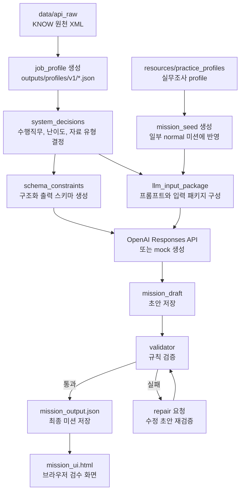

# Job Mission Prototype 3

KNOW/고용24 직업 데이터를 기반으로 직무 미션을 생성하고, 생성된 미션을 검증한 뒤 HTML 검수 화면으로 내보내는 프로토타입 프로젝트입니다.

현재 기본 파이프라인은 다음 흐름으로 동작합니다.

```text
KNOW API raw XML
-> job_profile
-> system_decisions
-> llm_input_package
-> OpenAI Responses API
-> mission_draft
-> validator / repair
-> mission_output.json
-> mission_ui.html
```

아래 흐름도는 입력 데이터가 미션 JSON과 검수용 HTML로 저장되는 과정을 요약합니다.



최근에는 미션 품질을 높이기 위해 구조화된 실무 profile을 `job_practice_profile`과 `mission_seed`로 변환해 생성 보조자료로 쓰는 흐름을 추가했습니다. 공개용 상세 설명은 `document/mission_generation_flow.md`를 참고합니다.

## Current Status

현재 GitHub에는 검수용 HTML UI와, 해당 UI와 매칭되는 원본 실행 산출물을 함께 올립니다. `outputs/ui/v1/runs/{run_id}/mission_ui.html`이 올라간 run은 같은 run id의 `outputs/pilot/v1/runs/{run_id}/`도 함께 커밋 대상입니다. `outputs/profiles/v1/*.json`도 검수 UI 해석에 필요한 기준 profile로 함께 관리합니다.

```text
outputs/ui/v1/runs/{run_id}/mission_ui.html
```

기본 파일럿 대상 직업은 4개이며, 각 직업에 대해 `normal`, `hard` 난이도를 생성합니다.

| job_cd | 직업명 |
|---|---|
| `K000000997` | 상품기획자 |
| `K000001080` | 데이터분석가(빅데이터분석가) |
| `K000001179` | 투자분석가 |
| `K000007519` | 보험상품개발자 |

## Repository Structure

```text
src/mission_generation/
  config.py                         # 파일럿 직업, 난이도, OpenAI runtime 설정
  profile_loader.py                 # KNOW XML -> job_profile
  system_decision_builder.py        # 수행직무, 난이도, 자료 유형 결정
  schema_constraints_builder.py     # LLM structured output schema 생성
  draft_generator.py                # LLM 입력 패키지와 prompt 구성
  llm_runtime.py                    # OpenAI Responses API 호출
  validator.py                      # 생성 미션 검증
  repair_manager.py                 # validator 실패 시 repair 요청
  final_assembler.py                # 최종 mission_output 조립
  storage.py                        # run 산출물 저장
  ui_exporter.py                    # 검수용 HTML export

tests/                              # unittest 기반 테스트
document/                           # 공개용 프로젝트 설명 문서
resources/practice_profiles/        # 실무조사시트 기반 구조화 profile
outputs/ui/v1/runs/                 # GitHub에 올리는 검수용 HTML UI
outputs/pilot/                      # UI와 매칭되는 run만 GitHub 업로드
outputs/profiles/                   # 기준 job_profile JSON만 GitHub 업로드
data/api_raw/                       # KNOW 원천 XML, gitignore 대상
```

## Requirements

- Python 3.10 이상 권장
- OpenAI API key
- `data/api_raw/{job_cd}/` 아래 KNOW 상세 XML 파일
- 현재 코드는 외부 OpenAI SDK를 사용하지 않고 Python 표준 라이브러리 `urllib`로 Responses API를 직접 호출합니다.

`pyproject.toml`이나 `requirements.txt`는 아직 없습니다. 따라서 실행 시 `src`를 `PYTHONPATH`에 추가해야 합니다.

## Quick Start

GitHub에서 클론한 뒤에는 원천 데이터와 API key를 로컬에 준비한 다음 실행합니다. `outputs/` 폴더는 없어도 됩니다. 실행 중 필요한 하위 폴더는 코드가 자동으로 생성합니다.

1. 프로젝트 루트로 이동합니다.

```powershell
cd job_mission_proto_github
```

2. KNOW 원천 XML을 `data/api_raw/{job_cd}/` 아래에 둡니다.

```text
data/api_raw/
  K000000997/
    dtlGb_2.xml
    dtlGb_5.xml
    dtlGb_7.xml
    dtlGb_3.xml
```

필수 파일은 `dtlGb_2.xml`, `dtlGb_5.xml`, `dtlGb_7.xml`입니다. `dtlGb_3.xml`은 선택 파일입니다. 현재 실행 경로에서는 `data/k-means`, `data/raw`, 대용량 CSV 파일이 없어도 됩니다.

3. OpenAI API key를 설정합니다.

```powershell
$env:OPENAI_API_KEY="본인_API_KEY"
```

또는 프로젝트 루트에 `.env.local`을 만들 수 있습니다.

```text
OPENAI_API_KEY=본인_API_KEY
```

4. `src`를 Python import 경로에 추가합니다.

```powershell
$env:PYTHONPATH="src"
```

5. 테스트를 실행합니다.

```powershell
python -B -m unittest discover -s tests
```

6. 먼저 mock 모드로 한 직무만 빠르게 확인합니다.

```powershell
python -m mission_generation.pilot_runner --mock --jobs K000000997 --difficulties normal --concurrency 1
```

7. 실제 API로 실행합니다.

```powershell
python -m mission_generation.pilot_runner --jobs K000000997,K000001080 --difficulties normal --concurrency 1
```

전체 파일럿을 실행하려면 `--jobs`, `--difficulties` 옵션을 생략합니다.

```powershell
python -m mission_generation.pilot_runner --concurrency 1
```

8. 실행이 끝나면 콘솔에 출력된 run directory에서 run id를 확인합니다.

```text
outputs/pilot/v1/runs/pilot_v1_YYYYMMDD_HHMMSS
```

9. 생성된 run을 검수용 HTML로 내보냅니다.

```powershell
python -m mission_generation.ui_exporter --run-id pilot_v1_YYYYMMDD_HHMMSS
```

10. 생성된 HTML을 브라우저에서 열어 검수합니다.

```text
outputs/ui/v1/runs/pilot_v1_YYYYMMDD_HHMMSS/mission_ui.html
```

## GitHub Upload Policy

GitHub에는 코드, 테스트, 공개용 문서, 실무 profile, 검수용 HTML UI, 그리고 해당 UI와 매칭되는 원본 산출물을 올리는 것을 기준으로 합니다.

커밋 대상:

- `src/`
- `tests/`
- `document/`
- `resources/practice_profiles/`
- `outputs/ui/v1/runs/**/mission_ui.html`
- `outputs/profiles/v1/*.json`
- `outputs/pilot/v1/runs/{UI와_같은_run_id}/`

로컬 전용이며 커밋하지 않는 대상:

- `.env.local`, `.env`, `.env.*`
- `data/`
- `docx/`
- `outputs/profiles/**/*.tmp`
- `outputs/pilot/v1/runs/{UI와_매칭되지_않는_run_id}/`
- `outputs/_test_tmp/`

## API Key Setup

각 사용자는 본인의 OpenAI API key를 `OPENAI_API_KEY` 이름으로 설정하면 됩니다.

방법 1: 프로젝트 루트에 `.env.local` 생성

```text
OPENAI_API_KEY=본인_API_KEY
```

방법 2: PowerShell 환경변수로 설정

```powershell
$env:OPENAI_API_KEY="본인_API_KEY"
```

## Model Cost Option

기본 모델은 `src/mission_generation/config.py`의 `RuntimeConfig`에 설정된 `gpt-5.4-mini`입니다. 가격을 더 낮추는 것이 중요하면, 계정에서 사용 가능한 경우 `gpt-5.4-nano`로 바꿔 실행할 수 있습니다. 다만 이 변경은 아직 실제 실행으로 검증하지 않았기 때문에, 모델 접근 권한이나 API 지원 상태에 따라 동작하지 않을 수 있습니다.

변경 방법:

1. `src/mission_generation/config.py`를 엽니다.
2. `RuntimeConfig`의 `model` 값을 수정합니다.

```python
model: str = "gpt-5.4-nano"
```

기존 값은 다음과 같습니다.

```python
model: str = "gpt-5.4-mini"
```

현재 코드는 모델명을 환경변수로 덮어쓰지 않으므로, 모델을 바꾸려면 위 설정 파일을 수정해야 합니다. 변경 후에는 테스트를 한 번 실행한 뒤 실제 생성을 돌리는 것을 권장합니다.

```powershell
python -B -m unittest discover -s tests
```

실행 결과에서 적용 모델을 확인하려면 생성된 run 폴더의 `pilot_config.json` 또는 각 미션 폴더의 `llm_call_result_attempt_0.json` 안의 `model` 값을 확인합니다.

주의사항:

- `.env.local`은 프로젝트 루트에서만 자동으로 읽습니다.
- `.env.local`은 `.gitignore` 대상이므로 커밋하지 않습니다.
- 사용 중인 OpenAI 계정에 현재 설정된 모델 접근 권한과 사용 한도/크레딧이 있어야 합니다.
- API key가 없으면 실제 OpenAI 호출 대신 mock 생성으로 빠질 수 있습니다. 실행 후 `openai_api_called=true`인지 확인하세요.

## Run Tests

```powershell
python -B -m unittest discover -s tests
```

## Run Mission Generation

실제 OpenAI API를 사용해 기본 파일럿을 실행합니다.

```powershell
$env:PYTHONPATH="src"
python -m mission_generation.pilot_runner
```

병렬 수를 줄여 안정적으로 실행하려면:

```powershell
$env:PYTHONPATH="src"
python -m mission_generation.pilot_runner --concurrency 1
```

API 호출 없이 mock으로 실행하려면:

```powershell
$env:PYTHONPATH="src"
python -m mission_generation.pilot_runner --mock
```

실무조사시트가 반영된 2개 직무의 `normal` 미션만 실제 API로 생성하려면:

```powershell
$env:PYTHONPATH="src"
python -m mission_generation.pilot_runner --jobs K000000997,K000001080 --difficulties normal --concurrency 1
```

실행이 끝나면 콘솔에 run directory와 저장/실패 개수가 출력됩니다. 자세한 결과는 생성된 run 폴더의 `pilot_summary.json`을 확인합니다.

## Export Review UI

GitHub에 올라온 검수용 HTML은 브라우저에서 바로 열어 확인할 수 있습니다.

```text
outputs/ui/v1/runs/{run_id}/mission_ui.html
```

로컬에서 새로 생성한 run을 HTML 검수 UI로 내보내려면 콘솔에 출력된 run id를 사용합니다.

```powershell
$env:PYTHONPATH="src"
python -m mission_generation.ui_exporter --run-id 생성된_run_id
```

특정 위치의 pilot run을 직접 지정할 수도 있습니다.

```powershell
$env:PYTHONPATH="src"
python -m mission_generation.ui_exporter --pilot-run-dir outputs/pilot/v1/runs/생성된_run_id --ui-output-dir outputs/ui/v1/runs/생성된_run_id
```

생성 결과는 기본적으로 다음 위치에 저장됩니다.

```text
outputs/ui/v1/runs/{run_id}/mission_ui.html
```

## Important Outputs

파일럿 실행 시 run 폴더 안에 주요 산출물이 저장됩니다.

```text
outputs/pilot/v1/runs/{run_id}/
  pilot_config.json
  pilot_summary.json
  artifact_index.json
  _failed/failure_index.json
  profiles/{job_cd}.json
  jobs/{job_cd}/{difficulty}/
    system_decisions.json
    schema_constraints.json
    llm_input_package.json
    llm_call_result_attempt_0.json
    mission_draft_attempt_0.json
    validator_result_attempt_0.json
    mission_output.json
    run_status.json
  human_review/pilot_review.md
```

검수 시 우선 확인할 파일은 다음입니다.

| 파일 | 용도 |
|---|---|
| `pilot_summary.json` | 전체 성공/실패, API 호출 여부, 토큰 사용량 |
| `artifact_index.json` | 각 미션 산출물 경로 |
| `_failed/failure_index.json` | 실패한 target과 실패 코드 |
| `mission_output.json` | 최종 생성 미션 |
| `mission_ui.html` | 사람이 보는 검수 화면 |

## Key Documents

프로젝트를 이해할 때 추천하는 읽기 순서입니다.

| 문서 | 용도 |
|---|---|
| `document/project_overview.md` | 프로젝트 목적과 공개 범위 |
| `document/mission_generation_flow.md` | 미션 생성 파이프라인 |
| `document/data_requirements.md` | 로컬 데이터와 API key 준비 |
| `document/output_structure.md` | 생성 산출물 구조 |
| `document/json_field_reference.md` | 주요 JSON 파일과 필드 설명 |
| `document/review_ui_guide.md` | HTML 검수 UI 사용법 |
| `document/public_artifact_policy.md` | GitHub 공개/제외 기준 |

## Practice Survey Integration Plan

구조화 실무 profile 기반 개선은 다음 방향으로 진행합니다.

현재 기준 파일은 다음입니다.

| 파일 | 역할 |
|---|---|
| `resources/practice_profiles/v1/K000001080.json` | 데이터분석가 구조화 실무 profile |
| `resources/practice_profiles/v1/K000000997.json` | 상품기획자 구조화 실무 profile |

```text
구조화 실무 profile
-> job_practice_profile.v1
-> mission_seed.normal.v1
-> llm_input_package 확장
-> normal 미션 생성
```

우선 구현 대상은 다음으로 제한합니다.

| 항목 | 범위 |
|---|---|
| 대상 직업 | 데이터분석가, 상품기획자 |
| 난이도 | `normal`만 |
| 요청문 | 직접 인용 근거가 없으면 빈 값 유지 |
| 자료 | 조사시트는 자료 종류와 맥락만 제공, 실제 샘플 자료는 미션 생성 단계에서 생성 |

## Troubleshooting

`ModuleNotFoundError: No module named 'mission_generation'`

```powershell
$env:PYTHONPATH="src"
```

`openai_api_called=false`

```text
OPENAI_API_KEY가 없거나 mock 실행일 가능성이 큽니다.
프로젝트 루트의 .env.local 또는 PowerShell 환경변수를 확인하세요.
```

`OPENAI_AUTH_FAILED`

```text
API key가 잘못되었거나, 계정/프로젝트 권한 문제가 있을 수 있습니다.
OpenAI Platform에서 key, project, billing, model access를 확인하세요.
```

`OPENAI_RATE_LIMITED`

```text
요청 한도나 토큰 한도에 걸린 상태입니다.
concurrency를 1로 낮춰 실행하거나 잠시 후 다시 실행하세요.
```

`PROFILE_FAILED`

```text
data/api_raw/{job_cd}/ 아래 필요한 XML 파일이 있는지 확인하세요.
현재 data/ 폴더는 gitignore 대상이므로 별도로 준비해야 합니다.
```

## Security Notes

- API key를 채팅, 문서, 코드, 커밋에 남기지 않습니다.
- `.env.local`, `.env`, `.env.*`는 커밋하지 않습니다.
- raw OpenAI request/response는 기본 저장하지 않는 정책입니다.
