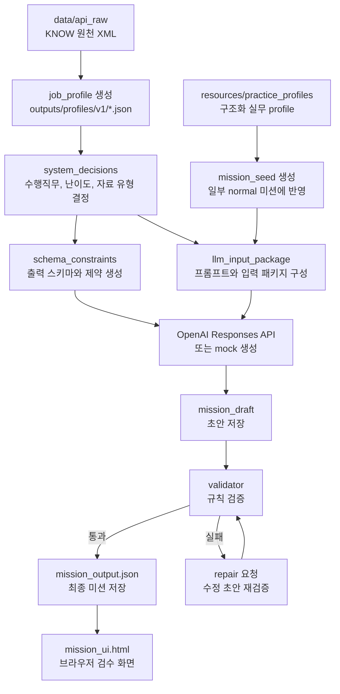

# Mission Generation Flow

이 문서는 미션이 어떤 과정을 거쳐 생성되는지 설명합니다. 처음 보는 사람은 “원천 XML이 어떻게 최종 `mission_output.json`과 `mission_ui.html`이 되는가”를 이해하는 데 집중하면 됩니다.

## High-Level Flow



## Step-by-Step

1. `profile_loader.py`가 `data/api_raw/{job_cd}/`의 XML을 읽습니다.
2. 직업별 `job_profile`을 만들고 `outputs/profiles/v1/{job_cd}.json`에 저장합니다.
3. `system_decision_builder.py`가 어떤 수행직무를 미션으로 만들지 결정합니다.
4. 난이도에 맞춰 사용할 자료 유형을 고릅니다. 예: chart, table, memo, email.
5. `schema_constraints_builder.py`가 LLM이 따라야 할 출력 구조를 만듭니다.
6. `draft_generator.py`가 LLM 입력 패키지와 prompt를 구성합니다.
7. `llm_runtime.py`가 OpenAI Responses API를 호출하거나 mock 결과를 만듭니다.
8. `validator.py`가 생성 결과가 규칙을 만족하는지 검사합니다.
9. 실패하면 `repair_manager.py`가 수정 요청을 만들고 다시 검증합니다.
10. 통과하면 `final_assembler.py`가 최종 `mission_output.json`을 만듭니다.
11. `ui_exporter.py`가 검수용 `mission_ui.html`을 생성합니다.

## Practice Profile Integration

`resources/practice_profiles/v1/`에는 공개 가능한 구조화 실무 profile이 있습니다. 이 profile은 직무 맥락을 더 현실적으로 만들기 위해 일부 `normal` 미션에 반영됩니다.

```text
resources/practice_profiles/v1/{job_cd}.json
-> job_practice_profile
-> mission_seed
-> llm_input_package 확장
-> normal 미션 생성
```

현재 공개 profile 대상은 데이터분석가와 상품기획자입니다.

## API Runtime

현재 코드는 외부 OpenAI SDK를 사용하지 않고 Python 표준 라이브러리 `urllib`로 Responses API를 직접 호출합니다.

기본 모델은 `src/mission_generation/config.py`의 `RuntimeConfig.model`에 설정되어 있습니다. 비용을 낮추기 위해 더 작은 모델로 바꿀 수 있지만, 모델 접근 권한과 API 지원 여부는 계정 상태에 따라 달라질 수 있습니다.

## Mock Runtime

API key 없이도 흐름을 빠르게 확인할 수 있도록 mock 모드가 있습니다.

```powershell
$env:PYTHONPATH="src"
python -m mission_generation.pilot_runner --mock --jobs K000000997 --difficulties normal --concurrency 1
```

mock 실행은 실제 품질 평가보다는 폴더 생성, 저장 구조, UI export 흐름 확인에 적합합니다.

