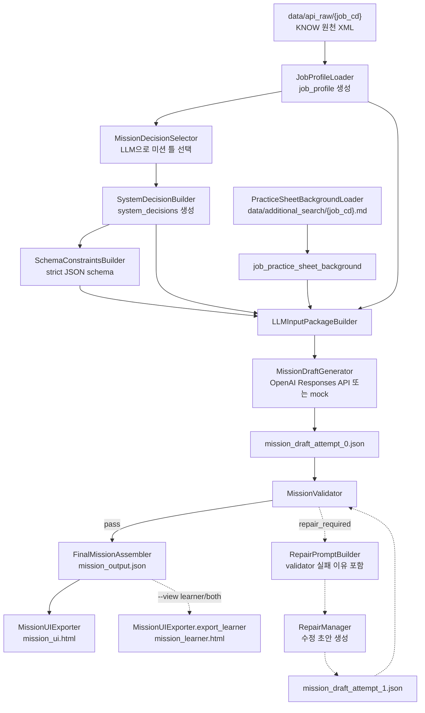

# Mission Generation Flow

이 문서는 미션이 어떤 과정을 거쳐 `mission_output.json`, `mission_ui.html`, `mission_learner.html`로 저장되는지 설명합니다.

## High-Level Flow

아래 다이어그램은 현재 우리가 기본으로 사용할 생성 경로만 단순화해 표시합니다.



## Step-by-Step

1. `profile_loader.py`가 `data/api_raw/{job_cd}/`의 XML을 읽어 `job_profile`을 만듭니다.
2. `storage.py`가 기준 profile을 `outputs/profiles/v1/{job_cd}.json`과 run 내부 `profiles/{job_cd}.json`에 저장합니다.
3. 기본값에서는 `decision_selector.py`의 `MissionDecisionSelector`가 LLM을 호출해 수행직무, 주 task 유형, 자료 유형, 미션 설계 유형을 먼저 고릅니다.
4. selector 결과가 검증을 통과하면 `system_decision_builder.py`가 이를 `system_decisions.v1`로 변환합니다.
5. selector가 꺼져 있으면 legacy `SystemDecisionBuilder` 규칙을 사용합니다. selector가 실제 응답을 반환했지만 검증에 실패하면 fallback하지 않고 `decision_failed`로 종료합니다.
6. `schema_constraints_builder.py`가 LLM structured output에 사용할 strict JSON schema를 만듭니다.
7. 기본값에서는 `practice_sheet_background_loader.py`가 `data/additional_search/{job_cd}.md`를 읽어 `job_practice_sheet_background`로 넣습니다.
8. `LLMInputPackageBuilder`가 `job_profile`, `system_decisions`, `schema_constraints`, `job_practice_sheet_background`를 묶어 `llm_input_package.json`을 만듭니다.
9. `draft_generator.py`가 prompt를 만들고 OpenAI Responses API 또는 mock으로 `mission_draft_attempt_0.json`을 생성합니다.
10. `validator.py`가 초안의 구조, system_decisions 일치 여부, material/task 참조, evidence, glossary, rubric 등을 검사합니다.
11. 통과하면 `final_assembler.py`가 `mission_id`, validator의 `evidence_chain`, `reliability`를 붙여 `mission_output.json`을 저장합니다.
12. 실패했지만 repair 가능하면 `repair_manager.py`가 validator의 실패 이유를 포함한 `repair_request_attempt_1.json`으로 다시 LLM을 호출합니다.
13. repair 초안도 다시 validator를 통과해야 최종 저장됩니다.
14. `ui_exporter.py`가 `mission_output.json`들을 모아 검토자용 `mission_ui.html` 또는 학습자용 `mission_learner.html`을 생성합니다.

## Decision Selector

`MissionDecisionSelector`는 최종 미션 본문을 쓰는 단계가 아닙니다. 미션을 만들기 전에 다음 후보만 고르는 전처리 LLM 호출입니다.

```text
selected_exec_job_id
primary_task_type
selected_material_types
mission_design_type
matched_evidence
selection_reason
confidence
```

selector 결과는 `DecisionSelectorValidator`가 실제 `exec_jobs`, 허용 task/material type, 실제 evidence name에 맞는지 검사합니다. 실제 selector 응답이 이 검증에 실패하면 해당 target은 `decision_failed`로 종료하며 기존 규칙이나 `auto_pilot_config`로 fallback하지 않습니다.

단, `--mock` 모드나 API key 없음처럼 selector 호출 자체가 local skipped 상태가 된 개발 상황에서는 테스트 실행을 위해 legacy `SystemDecisionBuilder` 규칙을 사용합니다.

관련 산출물:

```text
decision_selector_input.json
decision_selector_call_result.json
decision_selector_result.json
decision_selector_validation.json
```

## Practice Sheet Background Mode

현재 기본 생성 경로는 `mission_seed`가 아니라 직무조사시트 Markdown 배경지식입니다.

```text
data/additional_search/{job_cd}.md
-> PracticeSheetBackgroundLoader
-> job_practice_sheet_background
-> llm_input_package
```

이 모드에서는 다음이 성립합니다.

- `mission_seed.json`을 만들지 않습니다.
- `job_practice_profile_excerpt`를 넣지 않습니다.
- `llm_input_package.json`에는 `job_practice_sheet_background`가 들어갑니다.
- 직무조사시트는 현실감 보강용 배경지식이며, 학습자용 미션은 제공 자료만으로 풀 수 있어야 합니다.

legacy `mission_seed` 경로를 쓰려면 CLI에 `--mission-seed`를 줍니다.

```powershell
python -m mission_generation.pilot_runner --mission-seed --jobs K000001080 --difficulties normal
```

## Prompt and Structured Output

저장된 `llm_input_package.json`에는 `schema_constraints.structured_output_schema`가 포함됩니다. 그러나 실제 draft prompt를 만들 때는 prompt 입력량을 줄이기 위해 이 큰 schema 필드만 제거한 사본을 사용합니다.

출력 형식 자체는 prompt 본문이 아니라 OpenAI Responses API의 structured output 설정으로 강제합니다. 그래서 저장 산출물의 추적 가능성과 API 형식 강제를 유지하면서 prompt 입력량을 줄입니다.

## Glossary Handling

`mission.scenario.glossary`는 필수 필드입니다. 용어 설명이 필요 없으면 빈 배열 `[]`을 사용합니다.

LLM에는 용어 설명을 본문 끝에 `용어 설명:`처럼 붙이지 말고, 아래 구조로 분리하라고 지시합니다.

```json
[
  {"term": "데이터 자원", "definition": "분석에 쓰려고 모아 둔 데이터의 위치와 형태입니다."}
]
```

UI exporter는 과거 산출물 호환을 위해 본문 끝의 `용어 설명:` 패턴도 가능한 범위에서 glossary 카드로 분리합니다.

## Validation and Repair

validator는 단순 키워드 차단기가 아닙니다. 현재는 `인터넷`, `검색`, `외부 자료` 같은 단어가 있다는 이유만으로 실패 처리하지 않습니다.

쉽게 말하면 validator는 LLM이 만든 `mission_draft_attempt_N.json`을 보고 "이 초안을 최종 `mission_output.json`으로 저장해도 되는가?"를 판단하는 자동 검수자입니다. 주요 점검 항목은 다음과 같습니다.

| 점검 영역 | 쉽게 말하면 | 걸리는 예시 |
|---|---|---|
| JSON 형식 | 결과 파일이 JSON으로 제대로 읽히는지 확인합니다. | JSON이 중간에 끊겼거나 빈 값입니다. |
| 필수 구조 | 미션에 꼭 필요한 큰 항목이 있는지 봅니다. | `mission`, `materials`, `tasks`, `evaluation`, `reliability`가 없습니다. |
| LLM 권한 제한 | LLM이 직접 만들면 안 되는 최종값을 만들었는지 봅니다. | LLM이 `reliability.score`, `reliability.passed`, 최종 `evidence_chain`을 넣었습니다. |
| 시스템 결정 일치 | 앞단에서 정한 직무, 난이도, task 유형을 LLM이 그대로 따랐는지 확인합니다. | `system_decisions`는 easy인데 draft는 hard 난이도 구조를 씁니다. |
| 미션 사실 참조 | 자료가 `mission_facts`에 실제로 있는 key를 참조하는지 봅니다. | material이 존재하지 않는 `mission_fact_refs` 값을 씁니다. |
| 자료 유형 | 허용된 material type만 사용했는지 확인합니다. | `chart`, `table`, `memo` 대신 v1에서 제외된 `image`, `screenshot`을 씁니다. |
| 자료 내부 구조 | 자료 type별 `data` 모양이 맞는지 봅니다. | chart의 x축 개수와 series 값 개수가 다르거나, table row key가 columns와 다릅니다. |
| 자료 크기 | 난이도에 맞게 자료 수와 항목 수가 너무 많거나 적지 않은지 봅니다. | easy 미션에 자료가 너무 많거나, hard 미션 자료 항목이 너무 적습니다. |
| task와 자료 연결 | 과제가 실제 material id를 사용하고, 만든 material이 task에서 쓰이는지 확인합니다. | `tasks[].required_materials`가 없는 material id를 가리킵니다. |
| glossary | 용어 설명이 배열이고 각 항목에 `term`, `definition`이 있는지 봅니다. | glossary가 문자열이거나 definition이 빠져 있습니다. |
| 평가 기준 | rubric이라는 채점표가 있고, 점수와 근거 연결이 있는지 확인합니다. | rubric이 없거나, `points` 합계가 100이 아니거나, `linked_evidence`가 비어 있습니다. |
| 직무 근거 | material의 `evidence_source`가 실제 `job_profile.evidence` 이름인지 확인합니다. | LLM이 그럴듯하지만 실제 profile에 없는 evidence 이름을 지어냅니다. |

repair가 발생하면 LLM은 막힌 이유를 모르는 상태로 다시 생성하는 것이 아니라, `repair_request_attempt_1.json`에 담긴 validator errors/warnings와 수정 지침을 보고 재생성합니다.
